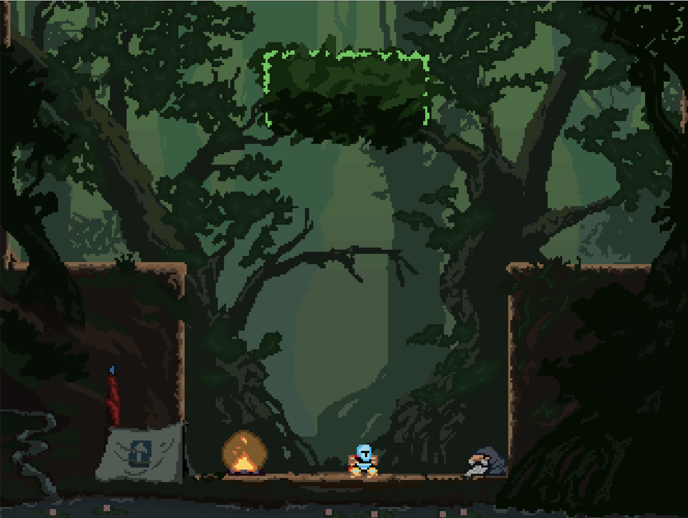
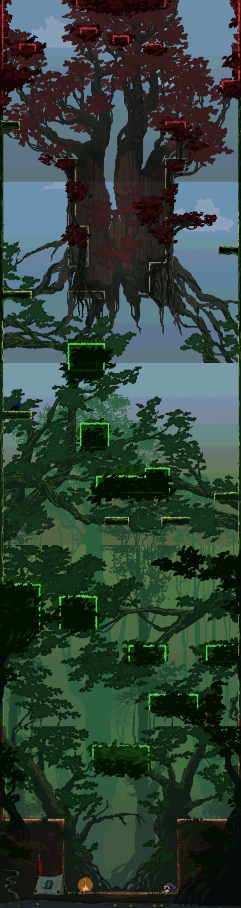

<h1 align="center"> LDTS_T02G03 - Jump King </h1>

    

## GAME DESCRIPTION

Jump King is a 2D platformer game where the main objective is to reach the top of the map. However, if you make a mistake, you risk falling and losing a significant part of your progress.

This game was developed for the hardcore players that are patient, 
precise and resilient. It has simple controls, no checkpoints and beautiful pixel art visuals.

We hope you enjoy this challenging journey! Please try not to rage too much :)

This project was developed by : <a href="https://github.com/andre-cotrim">André Cotrim</a> (up202305592@fe.up.pt), <a href="https://github.com/H-Aze2005">Hugo Azevedo</a> (up202305965@fe.edu.up.pt) and <a href="https://github.com/andre-cotrim">Joana Carvalhal</a> (up202306568@fe.up.pt) 

## LIST OF FEATURES
- **Main Menu** - Simple menu that prompts the user to start the game or exit the game.
- **Pause Menu** - A menu that can be accessed by pressing the `ESC` key during gameplay. The user can choose to resume the game, restart the game, or exit to the main menu.
- **Map Loader** - Loads the map from a text file.
- **Sprite Image Loader** - A class that processes PNG files into the game as sprite by drawing the images pixel by pixel using Lanterna. This is used by the Map Loader to load in the background image, as well as for loading the player character.
- **Sound Player** - A class that plays sound effects in the game.
- **Player Mobility** - The player character can move left and right, as well as jump. The player can also jump higher by holding the jump button for longer. The player can also jump left or right by inputting the respective direction while preparing to jump, this will result in movemnt in the form of an arc.
- **Collision Logic** - The player character can collide with the map, and will stop moving when colliding with a floor, and rebound when hitting a wall.
- **Finish Condition** - When the player reaches the "Princess" at the top of the map, the game ends.
- **Credits** - when finishing the game, the user is presented with an ending screen, where he can visualize the number of jumps and the total time of gameplay. Once done, the user can return to the main menu using the Escape button.

## GAME CONTROLS
- **Movement** - The player can move left and right using the `←` and `→` keys, respectively.
- **Jump** - The player can jump using the `↑` key. After pressing it once the `King` will prepare to jump, the longer the key is left, the higher the player will jump. The `King`jumps after a second key input is placed, jumping either upwards, towards the left or towards the right.
- **Pause** - The player can pause the game by pressing the `ESC` key. This will bring up the pause menu, where the player can choose to resume the game, restart the game, or exit to the main menu.

## GAME SCREENSHOTS AND MOCKUPS
**Starting Point**

    

**Whole Map Preview**

    

## Sprite Sheet

    

## Design Patterns and Architecure
- **MVC** - The game was developed using the Model-View-Controller design architecture. The Model is responsible for the game logic, the View is responsible for the game visuals, and the Controller is responsible for the game inputs.
    - **Usage**: `Application`, `KingController`, `SceneController`, `GameViewer`, `Scene`, `King` and more.
    - **Features**: Separates the application into three interconnected components. This separation helps manage complex applications by dividing the responsibilities.
    - **Consequences**: Can lead to a more complex code structure. It requires careful planning and understanding of the pattern to implement correctly.

    

- **Builder Pattern**:
  - **Usage**: `SceneBuilder` class.
  - **Features**: Provides a way to construct a complex object step by step. It allows for more readable and maintainable code when creating objects with many parameters.
  - **Consequences**: Can increase the complexity of the codebase. If not used properly, it can lead to an over-engineered solution.
- **Factory Pattern**:
  - **Usage**: `LanternaScreenCreator` class.
  - **Features**: Defines an interface for creating an object but lets subclasses alter the type of objects that will be created.
  - **Consequences**: Adds an extra layer of abstraction, which can make the code harder to understand. However, it provides flexibility in terms of object creation.
- **State Pattern**:
  - **Usage**: `State` and its subclasses like `GameState`.
  - **Features**: Allows an object to alter its behavior when its internal state changes. The object will appear to change its class.
  - **Consequences**: Can lead to a large number of classes and increased complexity. However, it makes the code more flexible and easier to maintain.

    

Here is the state machine for the game:

    

### Problems/Features and Consequences:
- **MVC Pattern**: It helps in organizing the code and separating concerns, making the application easier to manage and scale. However, it can lead to a more complex codebase and requires a good understanding of the pattern to implement effectively.
- **Builder Pattern**: It makes the construction of complex objects more manageable and readable. However, it can add unnecessary complexity if the objects being constructed are simple.
- **Factory Pattern**: It provides flexibility in object creation and decouples the client code from the concrete classes. However, it can make the code harder to follow due to the added layer of abstraction.
- **State Pattern**: It makes the code more flexible and easier to maintain by encapsulating state-specific behavior. However, it can lead to an increase in the number of classes and overall complexity.

## UML CLASS STRUCTURES AND OVERVIEW

    

## Testing
- **Unit Testing** - We used JUnit to test the individual components of the game, such as the collision logic, player movement, and map loading. This helped ensure that each component worked as expected in isolation.
- **Mock Testing** - We used Mockito to mock dependencies in our tests, such as the Lanterna library. This allowed us to test our code without relying on external dependencies.
  - Test results:

    

  

