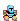
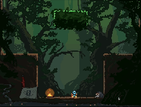
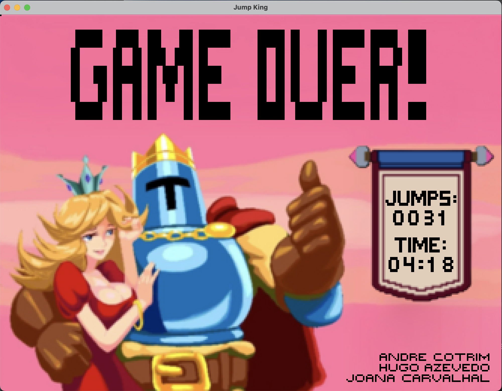

<h1 align="center"> LDTS_T02G03 - Jump King </h1>

    

## GAME DESCRIPTION

Jump King is a 2D platformer game where the main objective is to reach the top of the map in the fewest jumps possible. However, if you make a mistake, you risk falling and losing a significant part of your progress.

This game was developed for the hardcore players that are patient, 
precise and resilient. It has simple controls, no checkpoints and beautiful pixel art visuals.

We hope you enjoy this challenging journey! Please try not to rage too much :)

>

>This project was developed by : <a href="https://github.com/andre-cotrim">André Cotrim</a> (up202305592@fe.up.pt), <a href="https://github.com/H-Aze2005">Hugo Azevedo</a> (up202305965@fe.edu.up.pt) and <a href="https://github.com/andre-cotrim">Joana Carvalhal</a> (up202306568@fe.up.pt)
>

## LIST OF FEATURES
- **Main Menu** - Simple menu that prompts the user to start or quit the game.
- **Pause Menu** - A menu that can be accessed by pressing the `p` key during gameplay. The user can choose to resume the game or exit game.
- **Map Loader** - Reads and loads a map from a TXT file.
- **Sprite Image Loader** - A class that processes PNG files into the game as sprite by drawing the images pixel by pixel using Lanterna. This is used by the Map Loader to load in the background image, as well as for loading the player character.
- **Sound Player** - A class that plays background music for the game.
- **Player Mobility** - The player character can move left, right jump and fall. The player can also jump higher by letting leaving larger intervals between inputs after the jump is primed. The player can also jump left or right by inputting the respective direction while preparing to jump, this will result in movemnt in the form of an arc.
- **Finish Condition** - When the player reaches the `Princess` at the top of the map, the game ends.
- **Credits** - When finishing the game, either by quitting or reaching the `Princess` the user is presented with an ending screen, where he can visualize the number of jumps and the total time of taken. Once done, the user can return to the main menu using the `q` button.

## GAME CONTROLS
- **Movement** - The player can move left and right using the `←` and `→` keys, respectively.
- **Jump** - The player can jump using the `↑` key. After paressing it once the `King` will prepare to jump, the longer the key is left, the higher the player will jump. The `King`jumps after a second key input is placed, jumping either upwards, towards the left or towards the right.
- **Pause** - The player can pause the game by pressing the `p` key. This will bring up the `pause menu`, where the player can choose to resume the game, or exit the application.
- **Quit** - The player can quit the game at any time by pressing the `q` key. This will bring up the `credits`, which will then lead to the `main menu`, where the player can choose to start a new game or quit the application.

## GAME SCREENSHOTS AND MOCKUPS
<h4 align="center">
  King Character Design
</h4>

    

<h4 align="center">
  Sprite Sheet
</h4>

    

<h4 align="center">
  Start Menu
</h4>

    

<h4 align="center">
  Level and Gameplay Showcase
</h4>

    

    

    

<h4 align="center">
  Credits
</h4>

    

<h4 align="center">
  Map Preview
</h4>

    

## General Structure

    

>## Self Evaluation
>- **André Cotrim:** 33%
>- **Hugo Azevedo:** 37%
>- **Joana Carvalhal:** 30%
