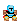
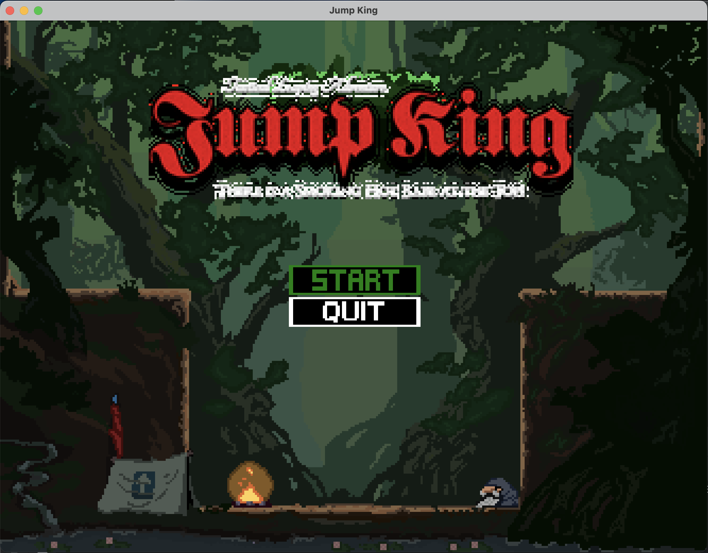
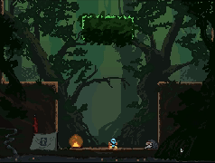
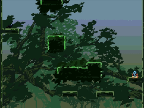
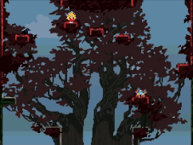
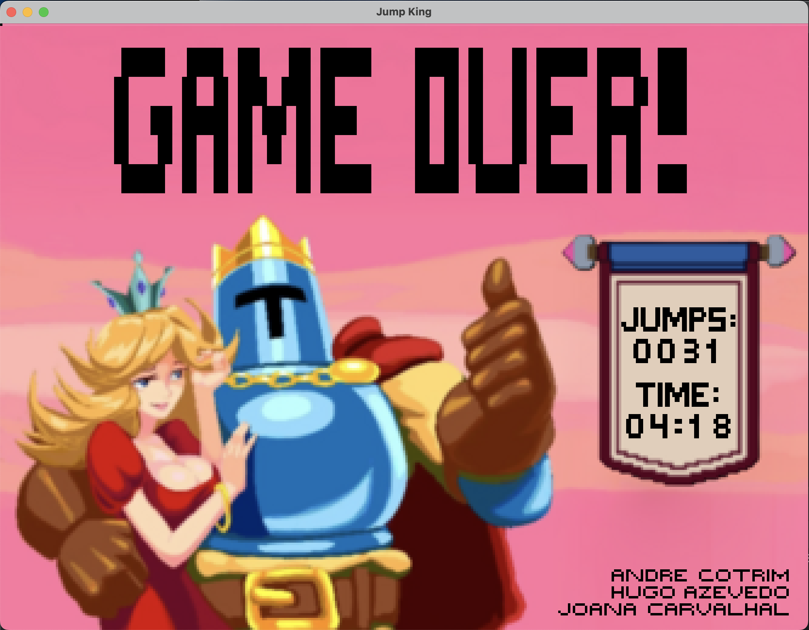
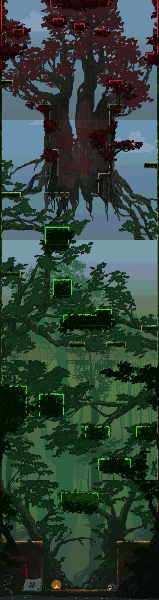

<h1 align="center"> LDTS_T02G03 - Jump King </h1>

    

## GAME DESCRIPTION

Jump King is a 2D platformer game where the main objective is to reach the top of the map in the fewest jumps possible. However, if you make a mistake, you risk falling and losing a significant part of your progress.

This game was developed for the hardcore players that are patient, 
precise and resilient. It has simple controls, no checkpoints and beautiful pixel art visuals.

We hope you enjoy this challenging journey! Please try not to rage too much :)

>

>This project was developed by : <a href="https://github.com/andre-cotrim">André Cotrim</a> (up202305592@fe.up.pt), <a href="https://github.com/H-Aze2005">Hugo Azevedo</a> (up202305965@fe.edu.up.pt) and <a href="https://github.com/andre-cotrim">Joana Carvalhal</a> (up202306568@fe.up.pt)
>

## Table of Contents

- [List of Features](#list-of-features)
- [Notes About Features](#notes-about-features)
- [Game Controls](#game-controls)
- [Game Screenshots and Mockups](#game-screenshots-and-mockups)
- [General Structure](#general-structure)
- [Code Design](#design)
  - [Model-View-Controller](#code-structure)
  - [Game Loop](#game-loop)
  - [State Pattern](#multiple-states)
  - [Adapter Pattern](#adapter-pattern)
  - [Builder Pattern](#builder-pattern)
  - [Factory Pattern](#factory-pattern)
- [Code Smells](#known-code-smells)
- [Code Testing](#testing)
- [Self Evaluation](#self-evaluation)

## LIST OF FEATURES
- **Main Menu** - Simple menu that prompts the user to start or quit the game.
- **Pause Menu** - A menu that can be accessed by pressing the `p` key during gameplay. The user can choose to resume the game or exit game.
- **Map Loader** - Reads and loads a map from a TXT file.
- **Sprite Image Loader** - A class that processes PNG files into the game as sprite by drawing the images pixel by pixel using Lanterna. This is used by the Map Loader to load in the background image, as well as for loading the player character.
- **Sound Player** - A class that plays background music for the game.
- **Player Mobility** - The player character can move left, right jump and fall. The player can also jump higher by letting leaving larger intervals between inputs after the jump is primed. The player can also jump left or right by inputting the respective direction while preparing to jump, this will result in movemnt in the form of an arc.
- **Finish Condition** - When the player reaches the `Princess` at the top of the map, the game ends.
- **Credits** - When finishing the game, either by quitting or reaching the `Princess` the user is presented with an ending screen, where he can visualize the number of jumps and the total time of taken. Once done, the user can return to the main menu using the `q` button.

## Notes About Features
Initially, we aimed to expand the player's movement options through the implementation of a rebounding mechanic, where, when the player would collide with a wall he would bounce back and fall down.
However, as we progressed through the development of the game and as time passed, we ended up abandoning this feature in favor of allowing for other inputs to be processed while the `King` is falling including jumping. As a result, this initialially planned feature was discarded and we have no plans of implementing it in the future as we're very satisfied with the result of our efforts.

## GAME CONTROLS
- **Movement** - The player can move left and right using the `←` and `→` keys, respectively.
- **Jump** - The player can jump using the `↑` key. After paressing it once the `King` will prepare to jump, the longer the key is left, the higher the player will jump. The `King`jumps after a second key input is placed, jumping either upwards, towards the left or towards the right.
- **Pause** - The player can pause the game by pressing the `p` key. This will bring up the `pause menu`, where the player can choose to resume the game, or exit the application.
- **Quit** - The player can quit the game at any time by pressing the `q` key. This will bring up the `credits`, which will then lead to the `main menu`, where the player can choose to start a new game or quit the application.

## GAME SCREENSHOTS AND MOCKUPS
<h4 align="center">
  King Character Design
</h4>

    

<h4 align="center">
  Sprite Sheet
</h4>

    

<h4 align="center">
  Start Menu
</h4>

    

<h4 align="center">
  Level and Gameplay Showcase
</h4>

    

    

    

<h4 align="center">
  Credits
</h4>

    

<h4 align="center">
  Map Preview
</h4>

    

## General Structure

    

## Design

### Code Structure
#### Problem in Context
When developing a software application with a graphical user interface (GUI), it is crucial to adopt a structural pattern that enforces separation of concerns. The goal is to ensure that the code adheres to the Single Responsibility Principle, enabling scalability and maintainability.
To address this, we implemented distinct approaches for handling input processing, visual rendering, and game logic management.

#### The Pattern
To address this, we adopted the Model-View-Controller (MVC) design pattern. This pattern divides the application into three interconnected components:

- **Model** - Manages the game data, rules, and logic.
- **View** - Handles rendering visuals and updating the screen.
- **Controller** - Processes user inputs and updates the Model accordingly.

This approach allows independent development and testing of each component, improving modularity.
#### Implementation
Examples of the implementation of this pattern can be observed in the following classes:

- `Application` - Manages the game flow and initializes the MVC components.
- `KingController` and `SceneController` - Handle input processing.
- `GameViewer` and Scene - Render visual elements based on the Model.
- `King` - Represents the logical entity within the Model.

An example structure of these components is illustrated in the following diagram:

    

#### Consequences
**Benefits:**
- Enhances code organization and modularity.
- Simplifies maintenance and scalability.
- Allows independent testing of components.

**Challenges:**
- May increase initial development complexity due to the need for careful planning.
- Requires a good understanding of the pattern to implement effectively.

### Game Loop
#### Problem in Context
Games require continuous updates to maintain gameplay flow, such as rendering graphics, processing input, and updating logic. Without a controlled loop, game performance may vary across different systems, leading to inconsistent behavior.
#### The Pattern
We implemented the Game Loop Pattern to handle these updates in a structured and predictable manner. The game loop continuously cycles through input handling, state updates, and rendering, ensuring consistent performance across devices.
#### Implementation
The start method in the Game class demonstrates this pattern:
- Iterates through input processing, state updates, and rendering steps.
- Maintains a fixed time step for updates to ensure consistent behavior.
- Controls frame rate by dynamically calculating delays between iterations.

The following diagram illustrates the game loop structure:

    

#### Consequences
**Benefits:**
- Ensures smooth and consistent gameplay across different hardware.
- Allows clear separation of input, update, and render phases.
- Facilitates debugging and testing through predictable behavior.

**Challenges:**
- Requires careful management of time steps and frame rate synchronization.
- May involve busy-waiting or sleep commands that some linters flag as bad practices.

### Multiple States
#### Problem in Context
Managing multiple game states (e.g., main menu, gameplay, pause screen) through conditional statements can lead to bloated and unmanageable code. This approach violates the Single Responsibility Principle and limits scalability.
#### The Pattern
To solve this, we implemented the State Pattern, which encapsulates each state into a separate class. Each state defines its behavior and manages transitions based on user input.
#### Implementation
This pattern is realized through the State class and its subclasses, such as GameState, MainMenuState, and SettingsMenuState.
Each state implements specific logic and transitions, isolating behavior.
The Game class executes the logic of the active state without needing to know its details.
The following diagram illustrates the state transitions:

    

There is also a state diagram showing the transitions between the different states:

    

#### Consequences
**Benefits:**
- Simplifies state management by avoiding lengthy conditional statements.
- Facilitates scalability by enabling the addition of new states without modifying existing code.
- Enhances maintainability through modular and testable code.

**Challenges:**
- May increase the number of classes, adding structural complexity.
- Requires careful design to ensure smooth transitions between states.

### Adapter Pattern
#### Problem in Context
Our game relies on the Lanterna library for terminal-based graphics. However, its API does not provide simple and intuitive methods for rendering visuals and handling input, leading to potential code duplication and reduced modularity.
#### The Pattern
To address this, we implemented the Adapter Pattern, which translates the Lanterna API into a simpler and more usable interface for our application.
#### Implementation
The LanternaGUI class acts as an adapter, providing a higher-level interface for rendering and input handling while utilizing Lanterna under the hood.
An explanation is also shows in the following diagram:

    

#### Consequences
**Benefits:**
- Simplifies interaction with the Lanterna API, improving code readability.
- Reduces code duplication by centralizing GUI functionality.
- Enhances modularity, allowing easier substitution of the graphics library if needed.

**Challenges:**
- Introduces an additional abstraction layer, which may increase initial development time.
- Requires careful mapping of methods between the adapter and the adaptee to ensure consistency.

### Builder Pattern
#### Problem in Context
Creating complex objects with multiple parameters can lead to code that is difficult to read and maintain. Hardcoding values directly into constructors may also result in errors and limit flexibility.
#### The Pattern
We utilized the Builder Pattern to simplify the creation of complex objects step-by-step. This approach enables customization while preserving readability.
#### Implementation
The SceneBuilder class demonstrates this pattern by constructing scene objects incrementally, defining each component before finalizing the build process.

    

#### Consequences
**Benefits:**
- Improves readability and maintainability when working with complex objects.
- Provides flexibility to add or remove parameters without altering existing code.

**Challenges:**
- Can add unnecessary complexity for simple objects.
- May lead to over-engineered solutions if not carefully planned.

### Factory Pattern
#### Problem in Context
When dealing with multiple object types, direct instantiation ties the code to specific implementations, reducing flexibility and violating the Open/Closed Principle.
#### The Pattern
To address this, we implemented the Factory Pattern, which defines an interface for object creation and delegates the responsibility of specifying the type to subclasses.
#### Implementation
This pattern is exemplified in the LanternaScreenCreator class, which creates GUI elements without hardcoding specific implementations.

    

#### Consequences
**Benefits:**
- Promotes flexibility by decoupling object creation from implementation.
- Simplifies scalability when introducing new object types.

**Challenges:**
- Adds an extra layer of abstraction, which may complicate debugging.
- Can make the code harder to follow for developers unfamiliar with the pattern.

## Known Code Smells

## Testing
- **Unit Testing** - We used JUnit to test the individual components of the game, such as the collision logic, player movement, and map loading. This helped ensure that each component worked as expected in isolation.
- **Mock Testing** - We used Mockito to mock dependencies in our tests, such as the Lanterna library. This allowed us to test our code without relying on external dependencies.
- **Test Coverage** - We aimed to achieve a high test coverage to ensure that our code was well-tested and reliable.
    - Instruction Coverage: 92%
    - Branch Coverage: 81.4%
    - [Coverage Report Summary](resources/htmlReport/index.html)
    

    

- **Mutation Testing** - We used PITest to perform mutation testing on our code. This helped us identify areas of our code that were not adequately tested and improve our test coverage.
    - Line Coverage:
    - Mutation Coverage:
    - Test Strength: 

>## Self Evaluation
 >- **André Cortim:** 30%
 >- **Hugo Azevedo:** 40%
 >- **Joana Carvalhal:** 30%
